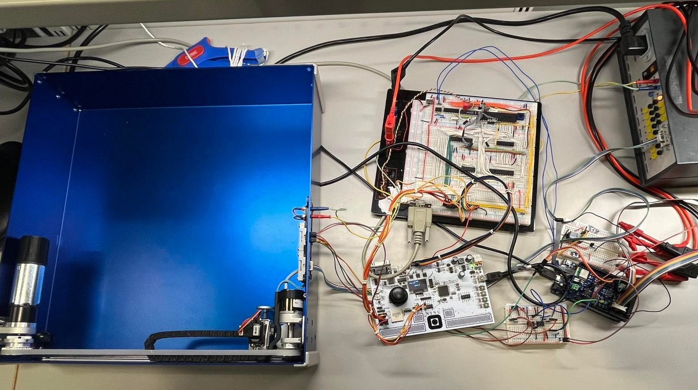

# [TTK4155 - Embedded and Industrial Computer Systems Design](http://www.ntnu.edu/studies/courses/TTK4155)
*In collaboration with [Khuong Huynh](https://github.com/Khuongh) and [Håvard Olai Kopperstad](https://github.com/haavardok).*

This repository includes all developed software for the course project.

The project's goal was to develop an embedded system for a fully functional one-player ping-pong game with an [Atmel AVR ATmega162](https://ww1.microchip.com/downloads/en/DeviceDoc/Atmel-2513-8-bit-AVR-Microntroller-ATmega162_Datasheet.pdf) and an arduino uno, including both software and hardware. The system included user controls with touchpads and a joystick, an LCD display with menu, game settings and statistics and ping-pong board including a motor, encoder, servo and solenoid for controlling the "racket" and an IR sensor for detecting the ball with PWM.

This work allowed me to develop my skills in developing embedded systems, including low-level programming, design of electrical circuits, bus communication (CAN bus) and implemenation of discrete control systems (PID controller for racket).

